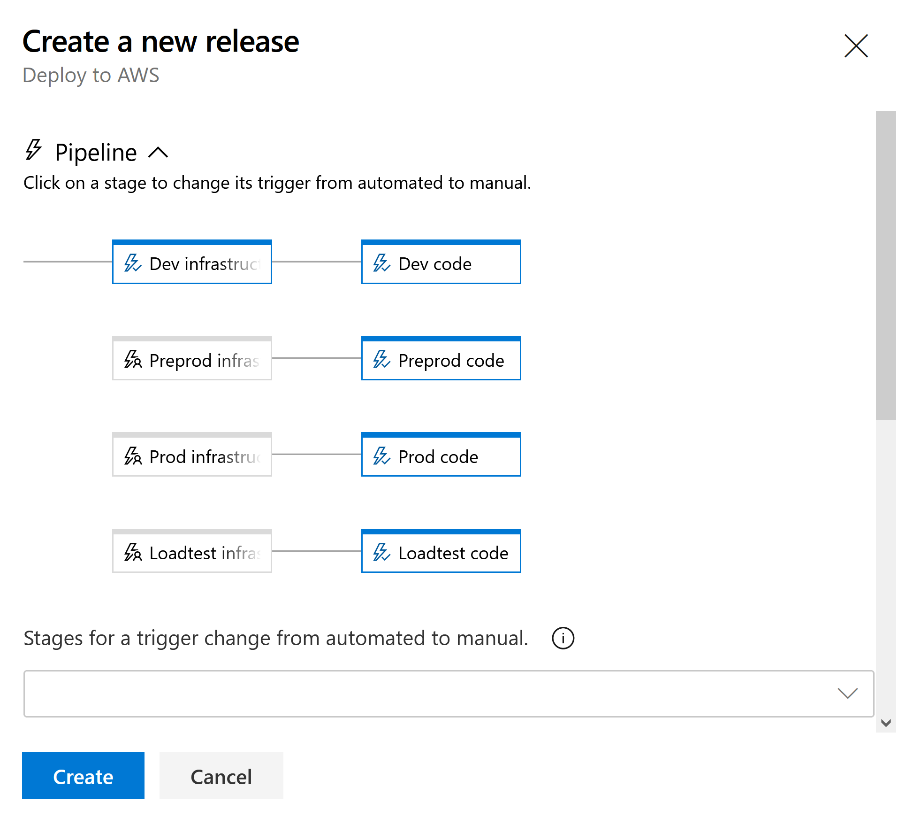

# Deployments

Deployments are run by our [Azure DevOps](https://dev.azure.com/govtequalitiesoffice/Gender%20Pay%20Gap/_build) instance.

## Builds
[Builds page in Azure DevOps](https://dev.azure.com/govtequalitiesoffice/Gender%20Pay%20Gap/_build)

Two builds are run whenever you push to any branch.  

First is the ['Build all branches - AWS'](https://dev.azure.com/govtequalitiesoffice/Gender%20Pay%20Gap/_build?definitionId=5)
pipeline you can see on Azure DevOps.

If you push to main, the pipeline also tags the main branch with the build number.
In GitKraken, you can see this by hovering over the main branch label at any point - it should also have a tag named something like `Build_66`.

The build:
* Builds the SCSS / JS code
* Builds the C# code
* Runs the C# automated tests
* Publishes some C# artifacts
  * The WebUI project  
    (the main website)
 

Second is the ['Infrastructure'](https://dev.azure.com/govtequalitiesoffice/Gender%20Pay%20Gap/_build?definitionId=4) pipeline.

The build:
* Publishes the terraform artifacts (the terraform configuration files)

## Releases / deployments
[Releases page in Azure DevOps](https://dev.azure.com/govtequalitiesoffice/Gender%20Pay%20Gap/_release)

A successful build of the main branch will automatically trigger a deployment to the Dev environment.  
A successful deploy to any environment also tags the git commit with the deployment number, e.g. `Dev_23`.

How to release:
* Go to the [Releases page in Azure DevOps](https://dev.azure.com/govtequalitiesoffice/Gender%20Pay%20Gap/_release)

* Choose the "Deploy to AWS" release in the left-hand side list (or use this [link](https://dev.azure.com/govtequalitiesoffice/Gender%20Pay%20Gap/_release?_a=releases&view=mine&definitionId=7))

* Click the blue "Create release" button (top right)
* Each environment consists of an Infrastructure release (that installs terraform and performs the terraform init and apply commands) and then the Code release (that deploys the new version of the application) 
* Choose the environment in the "Pipeline" drop down  
  
* Each infrastructure environment is triggered independently and will automatically trigger the code release in the same environment.

* Click the blue "Create" button

* If you are releasing to Production, you will need to "Approve" the release.  
  This isn't anything formal (you will have already asked the Delivery Manager if they're happy for you to release.  
  This is just a step to prevent us accidentally releasing to production when we meant to release to another environment.

* A new release item will be created and you can watch the progress
  (it normally takes about 3-4 minutes to deploy)

* Once the deployment is complete, you can check the build number in the code on the site - e.g.  
  * visit https://gender-pay-gap.service.gov.uk  
  * click "View Source" or "Inspect"  
  * The top section of the code will look like this...  
    ```html
    <!DOCTYPE html>
    <!-- Build number: 123 -->
    ```

## Our release process

* Create a "Release" ticket in Jira  
  [Here's an example of a Release ticket](https://technologyprogramme.atlassian.net/browse/GPG-411)
  * Work out which items you want to release  
    Look in the Git history to see which tickets we've done since the last production release

  * Add the list of tickets to be released  
    (In Jira, if you type "GPG-123" and press Enter, it will convert it to a link to the ticket)  
    **Note:** Make sure you add the complete list of tickets that have been comitted on the branch

  * Add the build number that you want to release  
    (you can find it from the git tag e.g. `Build_123`)

* Make sure all these tickets are tested and marked as "Done" in Jira  
  If there's anything that's not Done, ask the Delivery Manager to test it

* Deploy the build to PreProd
  
* Ask the Delivery Manager to test the build on PreProd and give the green light for us to deploy to Production

* Deploy to Production

* Update the Release Jira ticket with a comment containing:
  * The date of the release
  * The release number
  * The build number
  * The commit hash

* Tell the team (especially the Delivery Manager) that you've done the release
  so they can test and inform anyone they need to (e.g. the Service Desk)
