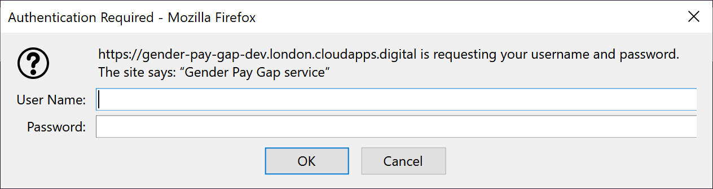
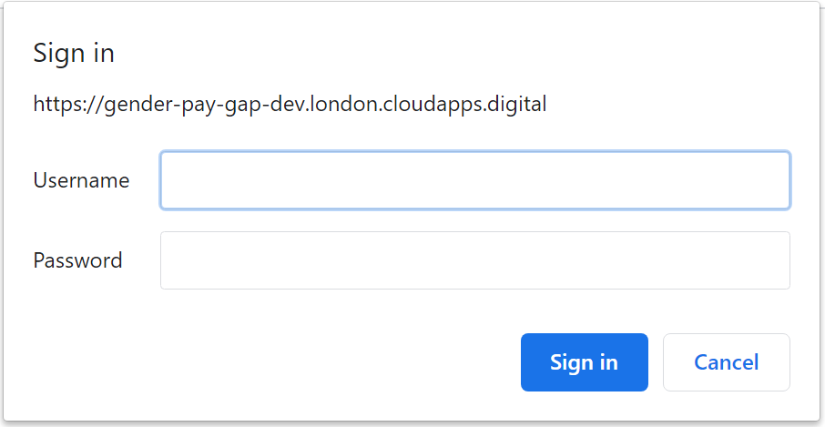

# Our environments

The Gender Pay gap service currently has 4 environments:

* **Development (Dev)**  
  https://gender-pay-gap-dev.london.cloudapps.digital  
  Each commit to the `master` branch deploys to Dev.  
  This is mainly used by developers - expect it to be broken some of the time.  
  This is where the Delivery Manager and Product Owner do some initial testing.

* **Testing (Test)**  
  https://gender-pay-gap-test.london.cloudapps.digital  
  This is mainly used for User Research / testing out new ideas with users

* **Pre-Production (PreProd)**  
  https://gender-pay-gap-preprod.london.cloudapps.digital  
  This is where we do our final set of testing before pushing changes to Live

* **Production / Live (Prod)**  
  https://gender-pay-gap.service.gov.uk  
  The real / live website

## Authentication
When you first visit a non-production environment, you will be asked for a username and password

This username and password prompt:
* Is not turned on in the Live environment
* Is not the same as the credentials that employers / admins use to login to the service
* Is mainly used to prevent the public mistaking our Dev site for the real site (and to prevent search engines from indexing the Dev site)

Ask an existing member of the team for the username and password.
